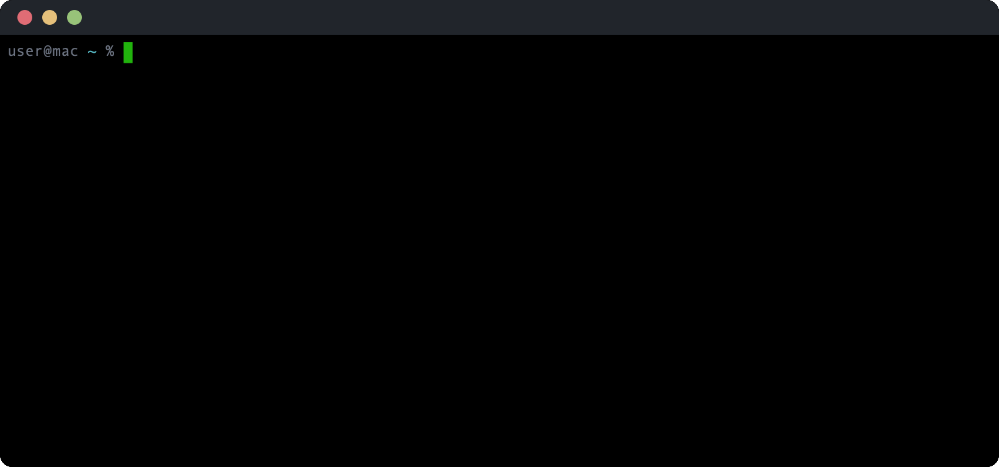

# cli2gif


Record a terminal command as an animated GIF. Captures a typing animation followed by live command output with full ANSI color and styling support.



## How it works

cli2gif records in three phases:

1. **Typing** — Animates the command being typed character-by-character with a configurable delay
2. **Execution** — Runs the command in a pseudo-terminal (PTY) and captures output frame-by-frame with proper ANSI rendering
3. **Hold** — Pauses on the final frame for a configurable duration

The tool includes a full terminal emulator — cursor movement, line wrapping, scrolling, and the complete ANSI color space (16-color, 256-color, and 24-bit RGB) are all handled natively. Frames are deduplicated to keep file sizes reasonable.

## Install

```sh
brew install ansilithic/tap/cli2gif
```

Or build from source (requires Xcode and macOS 14+):

```sh
make build && make install
```

## Usage

```
USAGE: cli2gif <command> -o <output> [options]

ARGUMENTS:
  <command>               Shell command to record

OPTIONS:
  -o, --output <file>     Output GIF path
  --typing-speed <ms>     Milliseconds per character (default: 80)
  --fps <n>               Frames per second during output (default: 20)
  --hold <ms>             Final frame hold time (default: 3000)
  --font-size <px>        Font size in pixels (default: 12)
  --cols <n>              Terminal columns (default: 80)
  --rows <n>              Terminal rows (default: 24)
  --padding <px>          Content padding (default: 6)
  --scale <n>             Pixel scale (default: 2)
  --timeout <s>           Max command runtime in seconds (default: 30)
  --prompt                Show styled terminal prompt
  --no-chrome             Skip window decoration
  -h, --help              Show help information
```

### Examples

```sh
# Record a simple command
cli2gif "echo hello world" -o hello.gif

# Record with a styled prompt and larger font
cli2gif "ls -la" -o listing.gif --prompt --font-size 14

# Narrow terminal, no window chrome
cli2gif "cal" -o cal.gif --cols 40 --rows 10 --no-chrome
```

## License

MIT
